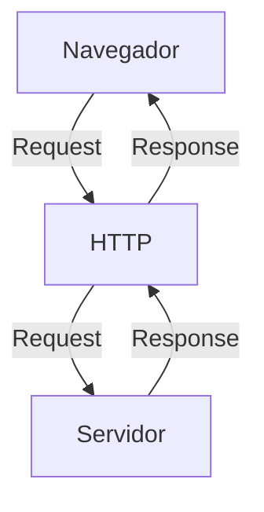

# Curso BackEnd - 1º Semestre - 105h

Prof. Diogo Barbosa

Escola SENAI Americana

2º Semestre 2026

## Objetivos do Curso

- Desenvolver Aplicações web Server Side, utilizando a linguagem PHP;
- Aplicar Sintaxe nativa PHP Vanilla;
- Manipulação HTTP;
- Persistência de Dados (Armazenamento em BD);
- Segurança contra SQL Injection/CSRF;
- Refatoração em POO (Programação Orientada Objeto);
- Arquitetura MVC;
- Utilização do FrameWork Laravel;

## Cronograma do Semestre 
Carga Horária: 105h 

Duração: 20 Semanas

### Introdução ao BackEnd e Configuração do Ambiente PHP

#### O que é BackEnd

 O back-end é a parte de um site ou aplicativo que o usuário não vê, mas que faz tudo funcionar por trás das telas.

- Guarda e organiza informações em um banco de dados;
- Confere se o login e a senha estão corretos;
- Calcula valores, como o frete ou o total de uma compra;
- Garante que os dados de um usuário não apareçam para outro;
- Faz o sistema suportar muitas pessoas usando ao mesmo tempo, sem travar.

As principais linguagens utilizadas no desenvolvimento back-end são PHP, JavaScript/TypeScript, Python, Java, Kotlin, Go (Golang), C# e Rust. 

O backend é o "cérebro" oculto de um site ou aplicativo. Ele roda em um servidor e cuida de tudo o que o usuário não vê na tela.

**As 3 partes básicas de todo backend:**

1. **Servidor:** o "computador" que fica ligado esperando pedidos (requisições);
2. **Banco de dados:**  onde as informações ficam guardadas (usuários, produtos, mensagens, etc.);
3. **Lógica de negócio:**  as regras do sistema (ex: "não deixa comprar se não tiver estoque").

**O Mercado de Trabalho em Back-end**

O desenvolvimento Back-end é uma das áreas mais cruciais da Tecnologia da Informação. 

- Com a transformação digital
acelerada, empresas de todos os portes e setores dependem de infraestruturas sólidas e seguras. 

- Setores de Atuação: Bancos, hospitais, e-commerces, logística, indústrias, startups e órgãos públicos utilizam Back
end para suportar suas operações críticas.

- Fatores de Crescimento: O avanço da computação em nuvem, aplicativos móveis, Big Data e IA impulsiona
continuamente a busca por profissionais da área.

- Modelos de Trabalho: Alta flexibilidade com vagas presenciais, híbridas e remotas (inclusive com oportunidades internacionais).

#### CIclo de Vida da Requisição HTTP

##### O que é HTTP 

**HTTP**, Hypertext Transfer Protocol, é um protocolo de comunicação utilizado para transferência de informações na WW(Word Wide Web) e em outros sistemas de Redes.

o HTTP é a base para que o cliente e um servidor web troquem informações. Ele permite a requisição e a respostas de recursos, como imagens, arquivos e as próprias páginas web, por meio de mensagens padrão (protocolo).

##### Como funciona o HTTP

1. O cliente estabelece contato com o servidor, encaminhando uma requisição HTTP;
2. Nessa Requisição o cliente especifica o método pretendido (read-GET, create-POST, update-PUT/PATCH, delete-DELETE);
3. O Servidor processa e responde com uma mensagem HTTP.

#### Como Funciona na prática o BackEnd

- **Ação do Usuário**: Envia uma Solicitação pela UI(Interface do Usuário). Exemplo de UI: Tela do Celular, Navegador da Internet, Alexa ...
- **Envio do Requisição**: A UI transforma ação do Usuário em uma Requisição HTTP 
- **O Processamento BackEnd**: o Código BackEnd recebe o pedido, valida os dados e decide o que fazer (Ex: consulta uma informação no banco de dados )
- **Resposta**: O servidor devolve o resultado para a UI (Ex. Um Login Autorizado, Uma Compra Confirmada )

#### Tipos de Requisição HTTP

Os Tipos de Requisição HTTP indicam a ação que o usuário deseja executar no servidor. As Principais ações são:

- **GET**: Pede dados de um lugar específico: "Não Faz Alterações no Servidor"
- **POST**: Envia dados novos para *criar* algo ou processar informações.
- **PUT/PATCH**: Modificar dados já Existentes.
     - PUT é a Atualização Total dos dados. 
     - PATCH é Atualização Parcial dos dados.
- **DELETE**: Apaga um dado do Servidor.

---
 
#### Iniciando o PHP

##### O que é PHP 
 
**PHP** (Hyperytext PreProcessor) é uma linguagem de programação interpretada e open source, focada no desenvolvimento de sistemas para web, pode ser usada junto com o HTML para criação de páginas web dinâmicas.

##### Instalando o PHP 

- Fazer o DownLoad do PHP (php.net);
- ZIP - Non Thread Safe 8.5;
- Descompactar o Arquivo do PHP na pasta C:\src\php;
   - (Para Descompactar, usar o 7Zip = Melhor).
   - => Nunca salvar o arquivo na raiz do sistema (C:).

- Modificar o arquivo php.ini-development para => php.ini;
   - ( Criar as configurções do PHP na Máquina).
   - Adicionar ou Remover funcionalidade do PHP.

- Adicionar a Pasta do PHP (C:\src\php) as Variaveis de Ambiente do Sistema (PACH).
- Verificar a instalação rodando o Comando php --version.

##### Contextualizando o PHP

O PHP de fato é uma das linguagens de programação mais populares da atualidade.
Ela permite que você crie aplicações web robustas, de uma maneira muito simplificada e direto ao ponto. 
Sem contar que a linguagem traz diveros recursos que facilitam e aceleram o processo de desenvolvimento de sites e sistemas para web. E além do mais, ela ainda tem um ótimo ecosistema, uma exelente comunidade e um grande mercado de trabalho.

##### Criando Minha Primeira Aplicação em PHP

Criando um Hello, World !!